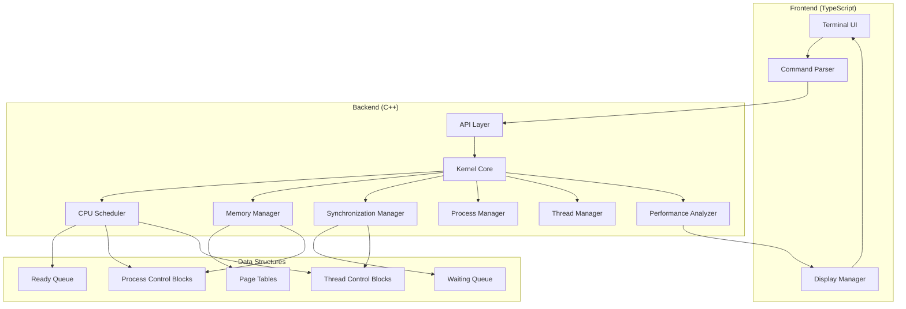
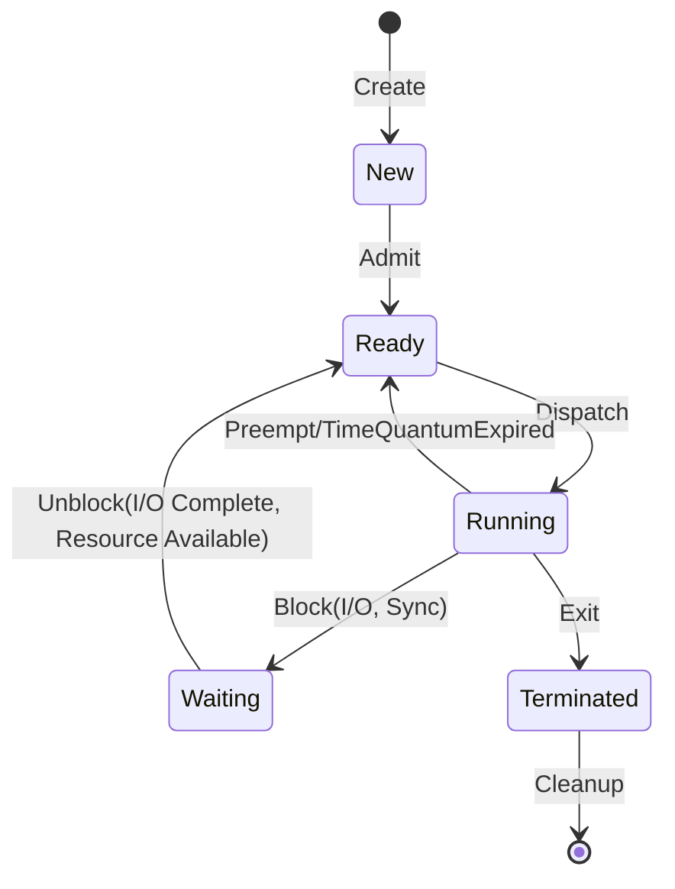

# Mini Operating System Kernel Simulator - Design Document

## Overview

The Mini Operating System Kernel Simulator is a user-level application that models fundamental operating system abstractions including process management, thread management, CPU scheduling, memory management with paging, and process synchronization. The system consists of a high-performance C++ backend implementing the core kernel simulation engine and a TypeScript frontend providing an interactive terminal-based user interface.

### Design Goals

1. **Educational Value**: Provide a clear, observable implementation of OS concepts (PCB, TCB, scheduling, paging, synchronization)
2. **Performance**: Handle 100+ processes and 500+ threads efficiently with minimal overhead
3. **Flexibility**: Support multiple scheduling algorithms, page replacement policies, and workload configurations
4. **Observability**: Provide detailed performance metrics and real-time state visualization
5. **Correctness**: Ensure accurate simulation of OS behaviors with comprehensive testing

### Key Design Decisions

- **C++ Backend**: Chosen for performance, efficient memory management, and direct control over data structures
- **TypeScript Frontend**: Provides type safety and modern terminal UI capabilities
- **Discrete Time Simulation**: Uses clock ticks for deterministic, reproducible execution
- **Modular Architecture**: Separates concerns (scheduling, memory, synchronization) for maintainability
- **API-Based Communication**: Clean separation between backend simulation engine and frontend UI

## Architecture

### System Architecture Diagram



### Component Responsibilities

#### Frontend Components

**Terminal UI**
- Renders command prompt and output
- Handles user input and keyboard events
- Displays real-time simulation state
- Provides command history and auto-completion

**Command Parser**
- Parses user commands and validates syntax
- Converts commands to API calls
- Provides error messages for invalid input

**Display Manager**
- Formats simulation state for display
- Updates performance metrics in real-time
- Manages terminal layout and rendering

#### Backend Components

**Kernel Core**
- Orchestrates all subsystems
- Manages simulation clock and time steps
- Coordinates process/thread lifecycle
- Handles event scheduling and dispatch

**CPU Scheduler**
- Implements scheduling algorithms (FCFS, Round Robin, Priority)
- Manages ready queue and process selection
- Performs context switches
- Tracks scheduling metrics

**Memory Manager**
- Manages virtual address spaces
- Maintains page tables per process
- Handles page faults and page replacement
- Implements FIFO and LRU policies

**Synchronization Manager**
- Provides mutex and semaphore primitives
- Manages waiting queues for synchronization objects
- Detects deadlocks and race conditions
- Tracks synchronization events

**Process Manager**
- Creates and destroys processes
- Maintains PCB for each process
- Manages process state transitions
- Handles resource allocation/deallocation

**Thread Manager**
- Creates and destroys threads
- Maintains TCB for each thread
- Associates threads with parent processes
- Manages thread state transitions

**Performance Analyzer**
- Collects metrics during simulation
- Calculates aggregate statistics
- Generates performance reports
- Supports metric comparison across runs

## Components and Interfaces

### Kernel Core

```cpp
class Kernel {
public:
    // Initialization
    void initialize(const Configuration& config);
    void reset();
    
    // Simulation control
    void start();
    void pause();
    void resume();
    void stop();
    void step();  // Execute one clock tick
    
    // Time management
    uint64_t getCurrentTime() const;
    void advanceClock();
    
    // Component access
    ProcessManager& getProcessManager();
    ThreadManager& getThreadManager();
    CPUScheduler& getScheduler();
    MemoryManager& getMemoryManager();
    SynchronizationManager& getSyncManager();
    PerformanceAnalyzer& getPerformanceAnalyzer();
    
private:
    uint64_t currentTime_;
    Configuration config_;
    std::unique_ptr<ProcessManager> processManager_;
    std::unique_ptr<ThreadManager> threadManager_;
    std::unique_ptr<CPUScheduler> scheduler_;
    std::unique_ptr<MemoryManager> memoryManager_;
    std::unique_ptr<SynchronizationManager> syncManager_;
    std::unique_ptr<PerformanceAnalyzer> perfAnalyzer_;
    bool running_;
    bool paused_;
};
```

### Process Control Block (PCB)

```cpp
enum class ProcessState {
    New,
    Ready,
    Running,
    Waiting,
    Terminated
};

enum class WaitReason {
    None,
    IO,
    Synchronization,
    Timer
};

struct PCB {
    uint32_t processId;
    ProcessState state;
    uint32_t priority;
    uint64_t arrivalTime;
    uint64_t startTime;
    uint64_t completionTime;
    uint64_t cpuBurstTime;
    uint64_t ioBurstTime;
    uint64_t remainingCpuTime;
    uint64_t waitingTime;
    WaitReason waitReason;
    
    // Memory management
    std::unique_ptr<PageTable> pageTable;
    size_t memorySize;
    
    // Thread management
    std::vector<uint32_t> threadIds;
    
    // Scheduling
    uint32_t timeQuantumRemaining;
    uint64_t lastScheduledTime;
    
    // File descriptors (simulated)
    std::vector<int> fileDescriptors;
};
```

### Thread Control Block (TCB)

```cpp
enum class ThreadState {
    New,
    Ready,
    Running,
    Waiting,
    Terminated
};

struct Registers {
    uint64_t pc;  // Program counter
    uint64_t sp;  // Stack pointer
    uint64_t r[16];  // General purpose registers
};

struct TCB {
    uint32_t threadId;
    uint32_t processId;
    ThreadState state;
    Registers registers;
    uint64_t creationTime;
    uint64_t startTime;
    uint64_t completionTime;
    uint64_t cpuTime;
    
    // Synchronization
    void* waitingOn;  // Mutex or Semaphore pointer
    WaitReason waitReason;
};
```

### CPU Scheduler Interface

```cpp
enum class SchedulingAlgorithm {
    FCFS,
    RoundRobin,
    Priority
};

class CPUScheduler {
public:
    virtual ~CPUScheduler() = default;
    
    // Scheduling operations
    virtual void addProcess(PCB* pcb) = 0;
    virtual PCB* selectNext() = 0;
    virtual void preempt(PCB* pcb) = 0;
    virtual void block(PCB* pcb, WaitReason reason) = 0;
    virtual void unblock(PCB* pcb) = 0;
    
    // Metrics
    virtual uint64_t getContextSwitchCount() const = 0;
    virtual double getAverageWaitingTime() const = 0;
    virtual double getAverageTurnaroundTime() const = 0;
};

class FCFSScheduler : public CPUScheduler {
private:
    std::queue<PCB*> readyQueue_;
    PCB* currentProcess_;
    uint64_t contextSwitches_;
};

class RoundRobinScheduler : public CPUScheduler {
public:
    explicit RoundRobinScheduler(uint32_t timeQuantum);
    
private:
    std::queue<PCB*> readyQueue_;
    PCB* currentProcess_;
    uint32_t timeQuantum_;
    uint64_t contextSwitches_;
};

class PriorityScheduler : public CPUScheduler {
public:
    explicit PriorityScheduler(bool enableAging, uint32_t agingThreshold);
    
private:
    struct PriorityComparator {
        bool operator()(const PCB* a, const PCB* b) const {
            return a->priority < b->priority;  // Higher priority first
        }
    };
    
    std::priority_queue<PCB*, std::vector<PCB*>, PriorityComparator> readyQueue_;
    PCB* currentProcess_;
    bool agingEnabled_;
    uint32_t agingThreshold_;
    uint64_t contextSwitches_;
};
```

### Memory Manager Interface

```cpp
struct Page {
    uint32_t virtualPageNumber;
    uint32_t physicalFrameNumber;
    bool valid;
    bool dirty;
    uint64_t lastAccessTime;
    uint64_t loadTime;
};

class PageTable {
public:
    void addMapping(uint32_t vpn, uint32_t pfn);
    Page* lookup(uint32_t vpn);
    void invalidate(uint32_t vpn);
    size_t size() const;
    
private:
    std::unordered_map<uint32_t, Page> pages_;
};

enum class PageReplacementPolicy {
    FIFO,
    LRU
};

class MemoryManager {
public:
    MemoryManager(size_t physicalMemorySize, size_t pageSize);
    
    // Address translation
    uint64_t translateAddress(uint32_t processId, uint64_t virtualAddress);
    
    // Page management
    void allocatePage(uint32_t processId, uint32_t vpn);
    void deallocatePage(uint32_t processId, uint32_t vpn);
    void accessPage(uint32_t processId, uint32_t vpn);
    
    // Page fault handling
    bool handlePageFault(uint32_t processId, uint32_t vpn);
    
    // Page replacement
    void setReplacementPolicy(PageReplacementPolicy policy);
    uint32_t selectVictimPage();
    
    // Metrics
    uint64_t getPageFaultCount() const;
    uint64_t getPageReplacementCount() const;
    
private:
    size_t physicalMemorySize_;
    size_t pageSize_;
    size_t numFrames_;
    std::vector<bool> frameAllocated_;
    std::unordered_map<uint32_t, std::unique_ptr<PageTable>> pageTables_;
    
    PageReplacementPolicy replacementPolicy_;
    std::queue<uint32_t> fifoQueue_;  // For FIFO policy
    std::map<uint64_t, uint32_t> lruMap_;  // timestamp -> frame for LRU
    
    uint64_t pageFaultCount_;
    uint64_t pageReplacementCount_;
};
```

### Synchronization Manager Interface

```cpp
class Mutex {
public:
    Mutex();
    
    bool tryLock(uint32_t threadId);
    void lock(uint32_t threadId);
    void unlock(uint32_t threadId);
    bool isLocked() const;
    uint32_t getOwner() const;
    
private:
    bool locked_;
    uint32_t owner_;
    std::queue<uint32_t> waitingThreads_;
};

class Semaphore {
public:
    explicit Semaphore(int initialCount);
    
    void wait(uint32_t threadId);
    void signal();
    int getCount() const;
    
private:
    int count_;
    std::queue<uint32_t> waitingThreads_;
};

class SynchronizationManager {
public:
    // Mutex operations
    uint32_t createMutex();
    void destroyMutex(uint32_t mutexId);
    bool lockMutex(uint32_t mutexId, uint32_t threadId);
    void unlockMutex(uint32_t mutexId, uint32_t threadId);
    
    // Semaphore operations
    uint32_t createSemaphore(int initialCount);
    void destroySemaphore(uint32_t semaphoreId);
    void waitSemaphore(uint32_t semaphoreId, uint32_t threadId);
    void signalSemaphore(uint32_t semaphoreId);
    
    // Deadlock detection
    bool detectDeadlock();
    std::vector<uint32_t> getDeadlockedThreads();
    
    // Race condition detection
    void recordMemoryAccess(uint32_t threadId, uint64_t address, bool isWrite);
    bool detectRaceCondition();
    
private:
    std::unordered_map<uint32_t, std::unique_ptr<Mutex>> mutexes_;
    std::unordered_map<uint32_t, std::unique_ptr<Semaphore>> semaphores_;
    uint32_t nextMutexId_;
    uint32_t nextSemaphoreId_;
    
    // Deadlock detection structures
    std::unordered_map<uint32_t, std::vector<uint32_t>> waitForGraph_;
    
    // Race condition detection
    struct MemoryAccess {
        uint32_t threadId;
        uint64_t address;
        bool isWrite;
        uint64_t timestamp;
    };
    std::vector<MemoryAccess> recentAccesses_;
};
```

### Performance Analyzer Interface

```cpp
struct PerformanceMetrics {
    // Scheduling metrics
    double averageWaitingTime;
    double averageTurnaroundTime;
    double cpuUtilization;
    uint64_t contextSwitchCount;
    double contextSwitchFrequency;
    
    // Memory metrics
    uint64_t pageFaultCount;
    double pageFaultRate;
    uint64_t pageReplacementCount;
    
    // Synchronization metrics
    uint64_t deadlockCount;
    uint64_t raceConditionCount;
    
    // Per-process metrics
    std::unordered_map<uint32_t, ProcessMetrics> processMetrics;
};

struct ProcessMetrics {
    uint32_t processId;
    uint64_t waitingTime;
    uint64_t turnaroundTime;
    uint64_t cpuTime;
    uint64_t ioTime;
    uint64_t pageFaults;
};

class PerformanceAnalyzer {
public:
    void recordProcessCreation(uint32_t processId, uint64_t time);
    void recordProcessStart(uint32_t processId, uint64_t time);
    void recordProcessCompletion(uint32_t processId, uint64_t time);
    void recordContextSwitch(uint64_t time);
    void recordPageFault(uint32_t processId, uint64_t time);
    void recordPageReplacement(uint64_t time);
    void recordDeadlock(uint64_t time);
    void recordRaceCondition(uint64_t time);
    
    PerformanceMetrics calculateMetrics(uint64_t totalTime) const;
    void exportResults(const std::string& filename, const Configuration& config) const;
    
private:
    struct Event {
        enum Type { ProcessCreated, ProcessStarted, ProcessCompleted, ContextSwitch, PageFault, PageReplacement, Deadlock, RaceCondition };
        Type type;
        uint32_t processId;
        uint64_t timestamp;
    };
    
    std::vector<Event> events_;
    std::unordered_map<uint32_t, ProcessMetrics> processMetrics_;
};
```

### Frontend-Backend API

The frontend communicates with the backend via a REST-like API or IPC mechanism:

```typescript
// TypeScript API Interface
interface SimulatorAPI {
    // Configuration
    setSchedulingAlgorithm(algorithm: 'FCFS' | 'RoundRobin' | 'Priority'): Promise<void>;
    setPageReplacementPolicy(policy: 'FIFO' | 'LRU'): Promise<void>;
    setTimeQuantum(quantum: number): Promise<void>;
    setMemorySize(size: number): Promise<void>;
    setPageSize(size: number): Promise<void>;
    
    // Workload management
    createProcess(config: ProcessConfig): Promise<number>;
    createThread(processId: number): Promise<number>;
    loadWorkload(workload: Workload): Promise<void>;
    
    // Simulation control
    start(): Promise<void>;
    pause(): Promise<void>;
    resume(): Promise<void>;
    stop(): Promise<void>;
    step(): Promise<void>;
    
    // State queries
    getSimulationState(): Promise<SimulationState>;
    getPerformanceMetrics(): Promise<PerformanceMetrics>;
    getProcessList(): Promise<ProcessInfo[]>;
    getReadyQueue(): Promise<number[]>;
    getWaitingQueue(): Promise<number[]>;
    
    // Results
    exportResults(filename: string): Promise<void>;
}

interface ProcessConfig {
    arrivalTime: number;
    cpuBurstTime: number;
    ioBurstTime: number;
    priority: number;
    memorySize: number;
}

interface SimulationState {
    currentTime: number;
    running: boolean;
    paused: boolean;
    currentProcess: number | null;
    readyQueueSize: number;
    waitingQueueSize: number;
}
```

## Data Models

### Process and Thread Lifecycle



### Memory Address Translation

Virtual Address Structure (32-bit):
```
| Virtual Page Number (20 bits) | Offset (12 bits) |
```

Physical Address Structure (32-bit):
```
| Physical Frame Number (20 bits) | Offset (12 bits) |
```

Translation Process:
1. Extract VPN from virtual address
2. Look up VPN in process page table
3. If valid bit is set, use PFN to construct physical address
4. If valid bit is not set, trigger page fault
5. On page fault, load page from disk and update page table

### Scheduling Data Structures

**Ready Queue (FCFS/Round Robin)**
```
Front -> [PCB*] -> [PCB*] -> [PCB*] -> Back
```

**Priority Queue (Priority Scheduling)**
```
Priority 10: [PCB*] -> [PCB*]
Priority 5:  [PCB*]
Priority 1:  [PCB*] -> [PCB*] -> [PCB*]
```

**Waiting Queue**
```
{
    IO: [PCB*] -> [PCB*],
    Mutex_1: [TCB*] -> [TCB*],
    Semaphore_2: [TCB*]
}
```

### Page Replacement Data Structures

**FIFO Queue**
```
Oldest -> [Frame 3] -> [Frame 7] -> [Frame 1] -> [Frame 5] -> Newest
```

**LRU Tracking**
```
{
    Frame 0: lastAccessTime = 1000,
    Frame 1: lastAccessTime = 1500,
    Frame 2: lastAccessTime = 800,   // Victim candidate
    Frame 3: lastAccessTime = 2000
}
```

## Data Models

### Configuration Model

```cpp
struct Configuration {
    // Scheduling
    SchedulingAlgorithm schedulingAlgorithm;
    uint32_t timeQuantum;  // For Round Robin
    bool agingEnabled;  // For Priority
    uint32_t agingThreshold;
    
    // Memory
    size_t physicalMemorySize;
    size_t pageSize;
    PageReplacementPolicy pageReplacementPolicy;
    
    // Simulation
    uint64_t maxSimulationTime;
    bool enableDeadlockDetection;
    bool enableRaceDetection;
    
    // Validation
    bool validate() const;
};
```

### Workload Model

```cpp
enum class ProcessType {
    CPUBound,
    IOBound,
    Mixed
};

struct ProcessSpec {
    uint64_t arrivalTime;
    uint64_t cpuBurstTime;
    uint64_t ioBurstTime;
    uint32_t priority;
    size_t memorySize;
    ProcessType type;
    uint32_t numThreads;
};

struct Workload {
    std::string name;
    std::vector<ProcessSpec> processes;
    
    static Workload createCPUBoundWorkload(size_t numProcesses);
    static Workload createIOBoundWorkload(size_t numProcesses);
    static Workload createMixedWorkload(size_t numProcesses);
};
```


## Correctness Properties

*A property is a characteristic or behavior that should hold true across all valid executions of a system—essentially, a formal statement about what the system should do. Properties serve as the bridge between human-readable specifications and machine-verifiable correctness guarantees.*

### Property Reflection

After analyzing all acceptance criteria, I identified the following property categories:
- **Process/Thread Management**: Uniqueness, state consistency, lifecycle correctness
- **Scheduling Invariants**: Algorithm-specific ordering and preemption rules
- **Memory Management**: Address translation, page fault handling, replacement policies
- **Synchronization**: Mutex/semaphore correctness, deadlock detection
- **Metrics**: Accurate calculation of performance measurements

**Redundancy Analysis:**
- Properties 3.3 and 3.4 (waiting time and turnaround time for FCFS) can be combined with 4.5 (same metrics for RR) into a general scheduling metrics property
- Properties 9.4 and 10.4 (eviction logging) are identical and can be combined into one memory management property
- Properties 6.2, 6.3, 6.4 (mutex operations) can be combined into a comprehensive mutex correctness property
- Properties 7.2, 7.3, 7.4 (semaphore operations) can be combined into a comprehensive semaphore correctness property

### Property 1: Process ID Uniqueness

*For any* sequence of process creations, all assigned process IDs SHALL be unique across all processes in the system.

**Validates: Requirements 1.2**

### Property 2: Process State Consistency

*For any* process state transition, the PCB state field SHALL match the process's actual state, and the process SHALL be present in exactly one queue (Ready, Waiting, or Terminated) corresponding to its state.

**Validates: Requirements 1.4, 1.5**

### Property 3: Process Termination Cleanup

*For any* process that terminates, its state SHALL be marked as Terminated, all allocated resources SHALL be deallocated, and all child threads SHALL be terminated.

**Validates: Requirements 1.5, 2.7**

### Property 4: Wait Reason Tracking

*For any* process moved to the Waiting state, a valid wait reason (I/O, Synchronization, or Timer) SHALL be recorded in the PCB.

**Validates: Requirements 1.7**

### Property 5: Thread ID Uniqueness Within Process

*For any* process, all thread IDs within that process SHALL be unique, though thread IDs may be reused across different processes.

**Validates: Requirements 2.4**

### Property 6: Thread-Process Association

*For any* thread created within a process, the thread's TCB SHALL contain the correct parent process ID, and the process's PCB SHALL include the thread ID in its thread list.

**Validates: Requirements 2.2**

### Property 7: Thread State Consistency

*For any* thread, its TCB state SHALL accurately reflect its current execution state, and state transitions SHALL follow valid state machine transitions.

**Validates: Requirements 2.3, 2.5**

### Property 8: Shared Memory Within Process

*For any* process with multiple threads, all threads SHALL share the same page table and virtual address space.

**Validates: Requirements 2.6**

### Property 9: FCFS Execution Order

*For any* sequence of process arrivals under FCFS scheduling, the execution order SHALL match the arrival order (first arrived, first executed).

**Validates: Requirements 3.1**

### Property 10: FCFS Non-Preemption

*For any* process running under FCFS scheduling, it SHALL NOT be preempted by the scheduler unless it voluntarily yields, blocks, or terminates.

**Validates: Requirements 3.2**

### Property 11: Round Robin Time Quantum

*For any* process running under Round Robin scheduling, if its time quantum expires before completion, it SHALL be preempted and moved to the back of the ready queue with a fresh time quantum for its next execution.

**Validates: Requirements 4.1, 4.2**

### Property 12: Round Robin Voluntary Block

*For any* process under Round Robin that blocks before its time quantum expires, it SHALL receive a full time quantum when it next becomes ready (no quantum penalty for voluntary blocking).

**Validates: Requirements 4.3**

### Property 13: Priority Scheduling Order

*For any* ready queue state under Priority scheduling, the scheduler SHALL select the process with the highest priority value, using FCFS ordering to break ties among processes with equal priority.

**Validates: Requirements 5.1, 5.2**

### Property 14: Priority Aging

*For any* process waiting in the ready queue with aging enabled, if its waiting time exceeds the aging threshold, its priority SHALL be incremented to prevent starvation.

**Validates: Requirements 5.3**

### Property 15: Preemptive Priority

*For any* running process under Priority scheduling, if a higher-priority process arrives in the ready queue, the running process SHALL be preempted immediately.

**Validates: Requirements 5.4**

### Property 16: Mutex Correctness

*For any* mutex:
- When available, lock() SHALL grant ownership immediately
- When held, lock() SHALL block the calling thread and add it to the waiting queue
- unlock() SHALL release ownership and wake the first waiting thread in FIFO order
- Preemption SHALL NOT affect lock ownership

**Validates: Requirements 6.2, 6.3, 6.4, 6.5**

### Property 17: Deadlock Detection

*For any* resource allocation graph with a cycle (circular wait condition), the deadlock detector SHALL identify the deadlock and report all involved threads.

**Validates: Requirements 6.6**

### Property 18: Semaphore Correctness

*For any* semaphore:
- wait() on a semaphore with count > 0 SHALL decrement the count
- wait() on a semaphore with count = 0 SHALL block the thread
- signal() SHALL increment the count or wake one waiting thread in FIFO order
- Multiple waiting threads SHALL be awakened in FIFO order

**Validates: Requirements 7.2, 7.3, 7.4, 7.6**

### Property 19: Virtual Address Translation

*For any* valid virtual address with a valid page table entry, address translation SHALL produce the correct physical address by combining the physical frame number from the page table with the offset from the virtual address.

**Validates: Requirements 8.3**

### Property 20: Page Fault Generation

*For any* virtual address access where the corresponding page table entry is invalid (not present in physical memory), a page fault SHALL be generated.

**Validates: Requirements 8.4**

### Property 21: Page Fault Handling

*For any* page fault:
- If free frames exist, the page SHALL be loaded into an available frame
- If no free frames exist, the page replacement policy SHALL be invoked to select a victim
- The page table SHALL be updated with the new mapping
- The page fault counter SHALL be incremented

**Validates: Requirements 8.5, 8.6, 8.7**

### Property 22: FIFO Page Replacement

*For any* page replacement under FIFO policy, the page that was loaded earliest (oldest in the FIFO queue) SHALL be selected as the victim and evicted.

**Validates: Requirements 9.2, 9.3**

### Property 23: LRU Page Replacement

*For any* page replacement under LRU policy, the page with the oldest access timestamp (least recently used) SHALL be selected as the victim and evicted.

**Validates: Requirements 10.2, 10.3**

### Property 24: Page Replacement Logging

*For any* page eviction, the evicted page number and eviction timestamp SHALL be recorded in the performance log.

**Validates: Requirements 9.4, 10.4**

### Property 25: Scheduling Metrics Accuracy

*For any* completed process:
- Waiting time SHALL equal (start time - arrival time)
- Turnaround time SHALL equal (completion time - arrival time)
- CPU time SHALL equal the sum of all time spent in Running state

**Validates: Requirements 3.3, 3.4, 4.5, 13.1, 13.2**

### Property 26: Context Switch Counting

*For any* simulation, the recorded context switch count SHALL equal the actual number of times the CPU switched from one process/thread to another.

**Validates: Requirements 4.4, 13.4**

### Property 27: Page Fault Rate Calculation

*For any* completed simulation, the page fault rate SHALL equal (total page faults / total memory accesses).

**Validates: Requirements 13.5**

### Property 28: CPU Utilization Calculation

*For any* completed simulation, CPU utilization SHALL equal (total time in Running state / total simulation time) × 100%.

**Validates: Requirements 13.3**

### Property 29: Simulation State Consistency

*For any* clock tick during simulation:
- At most one process SHALL be in Running state
- All processes SHALL be in exactly one state (New, Ready, Running, Waiting, or Terminated)
- The sum of processes in all queues SHALL equal the total number of created processes

**Validates: Requirements 15.1, 15.2, 15.3, 15.4, 15.5, 15.6, 15.7**


## Error Handling

### Error Categories

#### Configuration Errors
- **Invalid scheduling algorithm**: Return error with list of valid algorithms
- **Invalid time quantum**: Validate quantum > 0, return error if invalid
- **Invalid memory size**: Validate size > 0 and is power of 2, return error if invalid
- **Invalid page size**: Validate size > 0 and is power of 2, return error if invalid
- **Inconsistent configuration**: Validate all parameters are compatible

**Handling Strategy**: Validate all configuration before simulation starts. Provide specific error messages indicating which parameter is invalid and why. Do not start simulation with invalid configuration.

#### Runtime Errors
- **Out of memory**: When physical memory is exhausted and page replacement fails
- **Invalid process/thread ID**: When operations reference non-existent IDs
- **Invalid state transition**: When attempting illegal state changes
- **Deadlock detected**: When circular wait is detected
- **Race condition detected**: When unsynchronized access is detected

**Handling Strategy**: Log error with context (timestamp, involved processes/threads). For recoverable errors (invalid ID), return error code and continue. For fatal errors (out of memory), save state and terminate gracefully.

#### Synchronization Errors
- **Unlock without lock**: Thread attempts to unlock mutex it doesn't own
- **Double lock**: Thread attempts to lock mutex it already owns
- **Semaphore underflow**: Signal called more times than wait
- **Orphaned lock**: Process terminates while holding locks

**Handling Strategy**: Detect and log synchronization violations. For mutex errors, throw exception or return error code. For orphaned locks, automatically release locks when process terminates.

#### Memory Errors
- **Invalid virtual address**: Access to address outside process's address space
- **Page table corruption**: Invalid page table entries
- **Frame allocation failure**: Unable to allocate physical frame

**Handling Strategy**: For invalid addresses, generate segmentation fault and terminate process. For page table corruption, log error and attempt recovery. For allocation failure, invoke page replacement or report out of memory.

#### API Errors
- **Invalid command**: User enters unrecognized command
- **Missing parameters**: Command missing required parameters
- **Type mismatch**: Parameter has wrong type

**Handling Strategy**: Parse and validate all commands before execution. Provide helpful error messages with command syntax. Suggest corrections for common typos.

### Error Recovery Mechanisms

1. **Graceful Degradation**: When non-fatal errors occur, log them and continue simulation
2. **State Checkpointing**: Periodically save simulation state for recovery
3. **Automatic Cleanup**: Release resources when processes/threads terminate abnormally
4. **Deadlock Recovery**: Optionally abort one process to break deadlock cycle
5. **Error Logging**: Maintain detailed error log with timestamps and context

### Error Reporting

All errors should include:
- **Error code**: Unique identifier for error type
- **Error message**: Human-readable description
- **Context**: Relevant state information (process ID, timestamp, etc.)
- **Suggestion**: Recommended action to resolve error

Example error format:
```
[ERROR 1001] Invalid scheduling algorithm: "FCFSS"
Context: Configuration validation at time 0
Suggestion: Valid algorithms are: FCFS, RoundRobin, Priority
```

## Testing Strategy

### Testing Approach

The simulator will use a **dual testing approach** combining property-based testing for universal correctness properties and example-based testing for specific scenarios and edge cases.

### Property-Based Testing

**Framework**: We will use **Catch2** with **RapidCheck** for C++ property-based testing.

**Configuration**: Each property test will run a minimum of **100 iterations** to ensure comprehensive input coverage.

**Test Organization**: Each correctness property from the design document will have a corresponding property-based test tagged with:
```cpp
// Feature: mini-os-kernel-simulator, Property 1: Process ID Uniqueness
TEST_CASE("Process ID Uniqueness", "[property][process-management]") {
    rc::check("All process IDs are unique", [](/* generators */) {
        // Test implementation
    });
}
```

**Property Test Coverage**:
- **Process Management** (Properties 1-8): Test process/thread creation, state transitions, cleanup
- **Scheduling** (Properties 9-15): Test FCFS, Round Robin, and Priority scheduling invariants
- **Synchronization** (Properties 16-18): Test mutex, semaphore, and deadlock detection
- **Memory Management** (Properties 19-24): Test address translation, page faults, replacement policies
- **Metrics** (Properties 25-29): Test accuracy of performance calculations

**Generators**: We will implement custom generators for:
- Random process specifications (arrival time, burst times, priority)
- Random thread configurations
- Random memory access patterns
- Random synchronization scenarios
- Random scheduling events

### Example-Based Unit Testing

**Framework**: **Catch2** for C++ unit testing.

**Coverage Areas**:
1. **Configuration Validation**: Test valid and invalid configurations
2. **Workload Types**: Test CPU-bound, I/O-bound, and mixed workloads
3. **Error Conditions**: Test specific error scenarios (invalid IDs, out of memory, etc.)
4. **Edge Cases**: Test boundary conditions (empty queues, single process, maximum processes)
5. **Race Conditions**: Test known race condition patterns
6. **Deadlock Scenarios**: Test specific deadlock configurations (dining philosophers, etc.)

**Example Test Cases**:
```cpp
TEST_CASE("FCFS with single process", "[scheduling][fcfs]") {
    // Test FCFS behavior with one process
}

TEST_CASE("Round Robin with zero quantum", "[scheduling][roundrobin][error]") {
    // Test error handling for invalid quantum
}

TEST_CASE("Mutex deadlock with two threads", "[synchronization][deadlock]") {
    // Test deadlock detection with simple scenario
}

TEST_CASE("Page fault with no free frames", "[memory][page-fault]") {
    // Test page replacement triggering
}
```

### Integration Testing

**Scope**: Test complete workflows from process creation to termination.

**Test Scenarios**:
1. **End-to-End Simulation**: Create processes, run simulation, verify metrics
2. **Frontend-Backend Communication**: Test API calls and responses
3. **Configuration Loading**: Test loading and applying configurations
4. **Workload Execution**: Test predefined workloads execute correctly
5. **Results Export**: Test exporting results to files
6. **Terminal Commands**: Test all terminal commands work correctly

**Tools**: Integration tests will use Catch2 for backend and Jest/Vitest for frontend.

### Performance Testing

**Benchmarks**:
1. **Scalability**: Test with 100 processes, 500 threads (Requirement 23.1, 23.2)
2. **Memory Capacity**: Test with 1GB virtual memory (Requirement 23.3)
3. **Execution Time**: Verify 100-process workload completes in < 10 seconds (Requirement 23.4)
4. **Resource Usage**: Monitor host CPU and memory consumption (Requirement 23.5)

**Tools**: Use Google Benchmark for C++ performance testing.

### Test Coverage Goals

- **Line Coverage**: Minimum 80% for core components
- **Branch Coverage**: Minimum 75% for scheduling and memory management
- **Property Coverage**: 100% of correctness properties tested
- **Integration Coverage**: All major workflows tested

### Continuous Testing

- **Pre-commit**: Run unit tests and property tests (fast subset)
- **CI Pipeline**: Run full test suite including integration and performance tests
- **Nightly**: Run extended property tests with 1000+ iterations

### Test Data

**Predefined Workloads**:
1. **CPU-Bound**: 10 processes, long CPU bursts, minimal I/O
2. **I/O-Bound**: 10 processes, short CPU bursts, frequent I/O
3. **Mixed**: 20 processes, combination of CPU and I/O bound
4. **Priority Test**: Processes with varying priorities
5. **Synchronization Test**: Processes with shared resources

**Random Workload Generation**: Property tests will generate random workloads with:
- Arrival times: 0 to 1000 time units
- CPU burst times: 10 to 500 time units
- I/O burst times: 5 to 100 time units
- Priorities: 1 to 10
- Memory sizes: 1KB to 100MB

### Testing the Testing

**Mutation Testing**: Use mutation testing to verify property tests catch bugs:
- Introduce deliberate bugs in scheduler (wrong queue order)
- Introduce bugs in memory manager (incorrect address translation)
- Verify property tests fail as expected

**Known-Bug Testing**: Create tests for known OS bugs:
- Priority inversion
- Convoy effect in FCFS
- Belady's anomaly in FIFO paging
- Verify simulator correctly demonstrates these phenomena


## Implementation Considerations

### Backend Implementation (C++)

#### Build System
- **CMake**: Use CMake for cross-platform build configuration
- **C++17**: Target C++17 standard for modern features
- **Dependencies**: Catch2 (testing), RapidCheck (property testing), nlohmann/json (JSON serialization)

#### Code Organization
```
backend/
├── src/
│   ├── kernel/
│   │   ├── Kernel.cpp
│   │   ├── ProcessManager.cpp
│   │   ├── ThreadManager.cpp
│   │   └── PerformanceAnalyzer.cpp
│   ├── scheduling/
│   │   ├── CPUScheduler.cpp
│   │   ├── FCFSScheduler.cpp
│   │   ├── RoundRobinScheduler.cpp
│   │   └── PriorityScheduler.cpp
│   ├── memory/
│   │   ├── MemoryManager.cpp
│   │   ├── PageTable.cpp
│   │   └── PageReplacementPolicy.cpp
│   ├── synchronization/
│   │   ├── SynchronizationManager.cpp
│   │   ├── Mutex.cpp
│   │   └── Semaphore.cpp
│   ├── api/
│   │   └── APIServer.cpp
│   └── main.cpp
├── include/
│   └── [corresponding headers]
├── tests/
│   ├── unit/
│   ├── property/
│   └── integration/
└── CMakeLists.txt
```

#### Performance Optimizations
1. **Memory Pools**: Pre-allocate PCB and TCB objects to avoid frequent allocation
2. **Efficient Queues**: Use `std::deque` for ready/waiting queues for O(1) operations
3. **Hash Tables**: Use `std::unordered_map` for fast process/thread lookup by ID
4. **Priority Queue**: Use `std::priority_queue` for priority scheduling
5. **Cache Locality**: Keep frequently accessed data (current process, ready queue) in contiguous memory

#### Thread Safety
- Backend runs single-threaded simulation (no real concurrency)
- API server may handle concurrent requests, use mutex for shared state
- Simulation state is immutable during API calls

### Frontend Implementation (TypeScript)

#### Framework Selection
- **Terminal UI**: Use `blessed` or `ink` for terminal rendering
- **Build Tool**: Vite for fast development and building
- **Testing**: Vitest for unit tests, Playwright for E2E tests

#### Code Organization
```
frontend/
├── src/
│   ├── components/
│   │   ├── CommandPrompt.tsx
│   │   ├── ProcessList.tsx
│   │   ├── QueueDisplay.tsx
│   │   ├── MetricsPanel.tsx
│   │   └── HelpPanel.tsx
│   ├── api/
│   │   └── SimulatorClient.ts
│   ├── commands/
│   │   ├── CommandParser.ts
│   │   └── CommandRegistry.ts
│   ├── state/
│   │   └── SimulationState.ts
│   └── main.tsx
├── tests/
└── package.json
```

#### Command Structure
Commands follow the pattern: `<verb> <noun> [options]`

Examples:
```
set scheduling fcfs
set scheduling roundrobin --quantum 10
set scheduling priority --aging
set memory --size 1024 --page-size 4
create process --arrival 0 --cpu 100 --io 20 --priority 5
load workload cpu-bound
start
pause
resume
stop
step
show processes
show queues
show metrics
export results output.json
help
help set
```

#### Real-Time Updates
- Poll backend every 100ms for simulation state during execution
- Update UI components reactively based on state changes
- Use efficient diffing to minimize terminal redraws

### Backend-Frontend Communication

#### Communication Protocol
**Option 1: HTTP REST API**
- Backend runs HTTP server on localhost
- Frontend makes REST calls for all operations
- Pros: Simple, language-agnostic, easy to debug
- Cons: Higher latency, more overhead

**Option 2: IPC (Inter-Process Communication)**
- Use named pipes or Unix domain sockets
- Frontend and backend communicate via binary protocol
- Pros: Lower latency, more efficient
- Cons: Platform-specific, more complex

**Recommendation**: Start with HTTP REST API for simplicity, optimize to IPC if needed.

#### API Endpoints

```
POST   /api/config/scheduling          Set scheduling algorithm
POST   /api/config/memory              Set memory configuration
POST   /api/process/create             Create new process
POST   /api/thread/create              Create new thread
POST   /api/workload/load              Load workload
POST   /api/simulation/start           Start simulation
POST   /api/simulation/pause           Pause simulation
POST   /api/simulation/resume          Resume simulation
POST   /api/simulation/stop            Stop simulation
POST   /api/simulation/step            Execute one step
GET    /api/simulation/state           Get current state
GET    /api/simulation/metrics         Get performance metrics
GET    /api/process/list               Get all processes
GET    /api/queue/ready                Get ready queue
GET    /api/queue/waiting              Get waiting queue
POST   /api/results/export             Export results to file
```

#### Data Serialization
- Use JSON for all API requests and responses
- Define TypeScript interfaces matching C++ structures
- Use nlohmann/json library in C++ for serialization

### Development Workflow

#### Phase 1: Core Backend (Weeks 1-3)
1. Implement data structures (PCB, TCB, Page Table)
2. Implement Process and Thread Managers
3. Implement basic Kernel with clock management
4. Write unit tests for core components

#### Phase 2: Scheduling (Weeks 4-5)
1. Implement FCFS scheduler
2. Implement Round Robin scheduler
3. Implement Priority scheduler with aging
4. Write property tests for scheduling invariants

#### Phase 3: Memory Management (Weeks 6-7)
1. Implement page table and address translation
2. Implement page fault handling
3. Implement FIFO and LRU replacement policies
4. Write property tests for memory management

#### Phase 4: Synchronization (Week 8)
1. Implement Mutex and Semaphore
2. Implement deadlock detection
3. Implement race condition detection
4. Write property tests for synchronization

#### Phase 5: Performance Analysis (Week 9)
1. Implement metric collection
2. Implement performance calculations
3. Implement results export
4. Write property tests for metrics accuracy

#### Phase 6: API Layer (Week 10)
1. Implement HTTP server
2. Implement API endpoints
3. Write integration tests for API

#### Phase 7: Frontend (Weeks 11-12)
1. Implement terminal UI components
2. Implement command parser
3. Implement API client
4. Write E2E tests

#### Phase 8: Integration and Testing (Weeks 13-14)
1. Integration testing
2. Performance testing and optimization
3. Bug fixes and refinement
4. Documentation

### Deployment

#### Build Artifacts
- **Backend**: Compiled binary (`mini-os-simulator` or `mini-os-simulator.exe`)
- **Frontend**: Bundled JavaScript (`dist/` directory)
- **Launcher**: Shell script or batch file to start both components

#### Installation
```bash
# Build backend
cd backend
mkdir build && cd build
cmake ..
make

# Build frontend
cd frontend
npm install
npm run build

# Run simulator
./run-simulator.sh
```

#### Distribution
- Package as single executable using tools like `pkg` (Node.js) or static linking (C++)
- Provide pre-built binaries for Windows, macOS, and Linux
- Include sample workloads and configuration files

### Documentation

#### README.md Structure
1. **Project Overview**: What the simulator does and why
2. **Features**: List of supported algorithms and capabilities
3. **Installation**: Build and installation instructions
4. **Quick Start**: Simple example to get started
5. **Usage Guide**: Detailed command reference
6. **Architecture**: High-level architecture diagram and component descriptions
7. **Examples**: Sample workloads and expected outputs
8. **Development**: How to contribute and run tests
9. **Troubleshooting**: Common issues and solutions
10. **License**: Project license information

#### API Documentation
- Generate API documentation using Doxygen (C++) and TypeDoc (TypeScript)
- Include examples for each API endpoint
- Document all data structures and their fields

#### User Guide
- Comprehensive guide for using the terminal interface
- Explanation of scheduling algorithms and when to use them
- Explanation of page replacement policies
- How to interpret performance metrics
- Example scenarios and experiments

## Summary

This design document provides a comprehensive blueprint for implementing the Mini Operating System Kernel Simulator. The system is architected as a high-performance C++ backend implementing core OS abstractions (process management, scheduling, memory management, synchronization) with a TypeScript frontend providing an interactive terminal interface.

### Key Design Highlights

1. **Modular Architecture**: Clear separation of concerns with dedicated managers for processes, threads, scheduling, memory, and synchronization
2. **Multiple Algorithms**: Support for FCFS, Round Robin, and Priority scheduling; FIFO and LRU page replacement
3. **Comprehensive Testing**: Dual approach using property-based testing for universal correctness and example-based testing for specific scenarios
4. **Performance**: Designed to handle 100+ processes and 500+ threads efficiently
5. **Observability**: Detailed performance metrics and real-time state visualization
6. **Correctness**: 29 formally specified correctness properties ensuring accurate OS behavior simulation

### Implementation Priorities

1. **Correctness First**: Implement and test core algorithms correctly before optimizing
2. **Incremental Development**: Build and test components incrementally (data structures → scheduling → memory → synchronization)
3. **Property-Driven**: Write property tests alongside implementation to catch bugs early
4. **User Experience**: Provide clear error messages and helpful documentation

### Success Criteria

The implementation will be considered successful when:
- All 29 correctness properties pass with 100+ iterations
- All unit and integration tests pass
- Performance benchmarks meet requirements (100 processes in < 10 seconds)
- Terminal interface is responsive and intuitive
- Documentation is complete and clear
- Sample workloads demonstrate all features

This design provides a solid foundation for building an educational, performant, and correct operating system kernel simulator that will help users understand fundamental OS concepts through hands-on experimentation.
